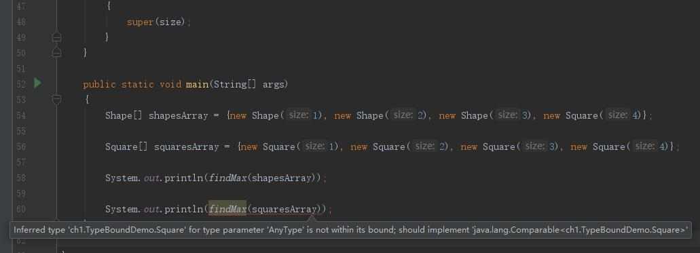

## 算法数据结构
> 参考书:《Data Structures And Algorithm analysis in Java 3rd Edition》
### chapter 1: 数据基础
#### 指数 Exponents
#### 对数 Logarithms
#### 级数 Series
#### 取余运算 Modular Arithmetic
#### 证明方法:
* 推导法
* 反证法
#### 递归简介    
#### 泛型简介
##### Pre Java 5

* Java数组为协变数组类型 Covariant array type, 存储不兼容类型会抛ArrayStoreException

##### Java 5 泛型
###### 泛型类和接口
###### 自动装箱
###### <>符
###### 限定范围的通配类型 Wildcards with Bounds
泛型集合类不协变

```
package ch1;

import sun.rmi.server.InactiveGroupException;

public class TypeBoundDemo
{
    public static <AnyType extends Comparable<AnyType>> AnyType findMax(AnyType[] arr)
    {
        int maxIndex = 0;
        for (int i = 0; i < arr.length; i++)
        {
            if (arr[i].compareTo(arr[maxIndex]) > 0)
            {
                maxIndex = i;
            }
        }

        return arr[maxIndex];
    }

    static class Shape implements Comparable<Shape>
    {
        private int size;


        public Shape(int size)
        {
            this.size = size;
        }

        public int compareTo(Shape o)
        {
            return this.size - o.size;
        }

        @Override
        public String toString()
        {
            return size + "";
        }
    }

    static class Square extends Shape
    {
        public Square(int size)
        {
            super(size);
        }
    }

    public static void main(String[] args)
    {
        Shape[] shapesArray = {new Shape(1), new Shape(2), new Shape(3), new Square(4)};

        Square[] squaresArray = {new Square(1), new Square(2), new Square(3), new Square(4)};

        System.out.println(findMax(shapesArray));

        System.out.println(findMax(squaresArray)); //会报错 提示推断的类型不正确, 推断的类型是Square, 但是该类型未实现Compare<Square>
    }

}
```


错误原因是Square 实现了 Compare<Shape>, 未实现Compare<Square>，为了克服泛型不能协变的问题， 需要将findMax做如下修改

```
    public static <AnyType extends Comparable<? super AnyType>> AnyType findMax(AnyType[] arr)
    {
        int maxIndex = 0;
        for (int i = 0; i < arr.length; i++)
        {
            if (arr[i].compareTo(arr[maxIndex]) > 0)
            {
                maxIndex = i;
            }
        }

        return arr[maxIndex];
    }
```
###### 类型擦除 
JVM不支持泛型
###### 泛型限制
因类型查出造成的限制
* 不支持原生类型泛型 Primitive Type
* instanceof 和类型强转 只对raw type有效
```
public class InstanceOfAndTypeCastDemo
{
    public static void main(String[] args)
    {
        GenericMemoryCell<Integer> cell1 = new GenericMemoryCell<Integer>();
        cell1.write(4);

        Object cell = cell1;

        GenericMemoryCell<String> cell2 = (GenericMemoryCell<String>)cell;//类型转化 在runtime时成功

        String S = cell2.read(); //此处报错ava.lang.ClassCastException: java.lang.Integer cannot be cast to java.lang.String
    }
}

``` 
* 静态方法和静态变量无法使用class的类型参数, 所有raw class的泛型实例,共享静态变量
* 不能创建泛型对象
```
T obj = new T(); //非法
```
* 不能创建泛型数组对象
```
T[] arr = new T[10];//非法
```
可以通过下面的方法创建
```
Object[] objArray = new Object[5];
T[] tArray = (T[]) objArray;
```
* 创建参数类型数组非法
```
    //非法
    GenericMemoryCell<String>[] arr1 = new enericMemoryCell<String>[10];
    GenericMemoryCell<Double> celD = new enericMemoryCell<>();
    celD.write(4.5);
    Object[] arr2 = arr1;
    arr1[0] = celD;//加入合法, 类型擦除后, 都是GenericMemoryCell, 不会抛出ArrayStoreException
    String s = arr1[0].read();
```
###### 函数对象 Function Object
函数通过对象传递, 这个对象就叫函数对象
```
Comparator<AnyType>
```
###### 泛型限制
###### 泛型限制
###### 泛型限制

### Chapter2 算法分析

### Chapter3 Lists, Stacks, and Queues

#### Lists
##### Remove On List
遍历删除List元素的各种情况: 结论是, 使用迭代器时不能通过List对象方法对List进行增删, 不然会造成迭代器失效, 抛出ConcurrentModificationException异常, fori 和 while(不是用迭代器)并没有问题
```java
package ch3;

import java.util.ArrayList;
import java.util.Iterator;
import java.util.List;

public class RemoveEnvenEleFromList
{
    public static void removeEvensVer1(List<Integer> list)
    {
        int i = 0;
        while (i < list.size())
        {
            if (list.get(i) % 2 == 0)
            {
                list.remove(i);
            }
            else
            {
                i++;
            }
        }
    }

    public static void removeEvensVer2(List<Integer> list)
    {
        for (int i = 0; i < list.size(); i++)
        {
            if (list.get(i) % 2 == 0)
            {
                list.remove(i);
            }
        }
    }


    public static void removeEvensVer3(List<Integer> list)
    {
        for(Integer i : list)
        {
            if (i % 2 == 0)
            {
                list.remove(i);
            }
        }
    }

    public static void  addInEnhancedFor(List<Integer> list)
    {
        for (Integer i : list)
        {
            if (i == 5)
            {
                list.add(100);
            }
        }
    }

    public static void removeEvensVer4(List<Integer> list)
    {
        Iterator<Integer> iterator = list.iterator();
        while (iterator.hasNext())
        {
            Integer ele = iterator.next();
            if (ele % 2 == 0)
            {
                iterator.remove();
            }
        }
    }

    public static void addWhileIteratingWithIterator(List<Integer> list)
    {
        Iterator<Integer> iterator = list.iterator();
        while (iterator.hasNext())
        {
            Integer ele = iterator.next();
            if (ele == 5)
            {
                list.add(100);
            }
        }
    }

    public  static void initList(List list)
    {
        list.clear();//清空
        for (int i = 0; i < 10; i++)
        {
            list.add(i);
        }
    }


    public static void main(String[] args)
    {
        List list = new ArrayList();

        //未报错
        initList(list);
        removeEvensVer1(list);

        //未报错
        initList(list);
        removeEvensVer2(list);

        //报错 java.util.ConcurrentModificationException
        initList(list);
        removeEvensVer3(list);

        //未报错
        initList(list);
        removeEvensVer4(list);

        //报错 ConcurrentModificationException
        initList(list);
        addInEnhancedFor(list);

        //报错 ConcurrentModificationException
        initList(list);
        addWhileIteratingWithIterator(list);

        //结论: 使用迭代器时, 只能使用迭代器修改列表, 不然会造成迭代器失效, 从而报错
    }
}
```
##### 控制并发修改的原理: modCount

```java
public abstract class AbstractList<E> extends AbstractCollection<E> implements List<E> {
    protected transient int modCount = 0;//当前List记录修改次数

     private class Itr implements Iterator<E> {
         int expectedModCount = modCount; 
     }

     final void checkForComodification() {
            if (modCount != expectedModCount)
                throw new ConcurrentModificationException();
     }
}
```
java.util.LinkedList 没有额外的头结点 和尾节点

##### HashMap在并发环境下, 形成循环链表的分析
HashMap key允许为null, 默认hash值为0

这扩容的过程。当多个线程同时对这个HashMap进行put操作，而察觉到内存容量不够，需要进行扩容时，多个线程会同时执行resize操作，而这就出现问题了，问题的原因分析如下：
```java
   /**
     * Rehashes the contents of this map into a new array with a
     * larger capacity.  This method is called automatically when the
     * number of keys in this map reaches its threshold.
     *
     * If current capacity is MAXIMUM_CAPACITY, this method does not
     * resize the map, but sets threshold to Integer.MAX_VALUE.
     * This has the effect of preventing future calls.
     *
     * @param newCapacity the new capacity, MUST be a power of two;
     *        must be greater than current capacity unless current
     *        capacity is MAXIMUM_CAPACITY (in which case value
     *        is irrelevant).
     */
    void resize(int newCapacity) {
        Entry[] oldTable = table;
        int oldCapacity = oldTable.length;
        if (oldCapacity == MAXIMUM_CAPACITY) {
            threshold = Integer.MAX_VALUE;
            return;
        }
 
        Entry[] newTable = new Entry[newCapacity];
        boolean oldAltHashing = useAltHashing;
        useAltHashing |= sun.misc.VM.isBooted() &&
                (newCapacity >= Holder.ALTERNATIVE_HASHING_THRESHOLD);
        boolean rehash = oldAltHashing ^ useAltHashing;
        transfer(newTable, rehash);
        table = newTable;
        threshold = (int)Math.min(newCapacity * loadFactor, MAXIMUM_CAPACITY + 1);
    }

```

```java
   /**
     * Transfers all entries from current table to newTable.
     */
    void transfer(Entry[] newTable, boolean rehash) {
        int newCapacity = newTable.length;
        for (Entry<K,V> e : table) {
            while(null != e) {
                Entry<K,V> next = e.next;
                if (rehash) {
                    e.hash = null == e.key ? 0 : hash(e.key);
                }
                int i = indexFor(e.hash, newCapacity);
                e.next = newTable[i];
                newTable[i] = e;
                e = next;
            }
        }
    }

```

首先，在HashMap扩容时，会改变链表中的元素的顺序，将元素从链表头部插入。
而环形链表就在这一时刻发生，以下模拟2个线程同时扩容。假设，当前hashmap的空间为2（临界值为1），hashcode分别为0和1，在散列地址0处有元素A和B，这时候要添加元素C，C经过hash运算，得到散列地址为1，这时候由于超过了临界值，空间不够，需要调用resize方法进行扩容，那么在多线程条件下，会出现条件竞争，模拟过程如下：

* 线程一：读取到当前的hashmap情况，在准备扩容时，线程二介入

    
* 线程二：读取hashmap，进行扩容
    
* 线程一：继续执行
    

这个过程为，先将A复制到新的hash表中，然后接着复制B到链头（A的前边：B.next=A），本来B.next=null，到此也就结束了（跟线程二一样的过程），但是，由于线程二扩容的原因，将B.next=A，所以，这里继续复制A，让A.next=B，由此，环形链表出现：B.next=A; A.next=B;

> 总结: A, B两个Node 在newTable中的位置恰巧相同, 由于线程2扩容时, 由于头插法, 造成了, A, B的顺序颠倒, 即B.next = A, 此时transfer继续执行, 将A.next 指向 newTable的第一元素, 即B, 此时形成循环链表

##### Stack
###### Stack应用
* 匹配字符 Balancing Symbols
* 后缀表达式(逆波兰表达式)计算 Postfix Expression/Reverse Polish notation 
* 中缀表达式转后缀表达式 Infix to Postfix Conversion
* 方法调用 Method Calls

    Activation Record or Stack Frame

    一般栈顶放当前环境，return提供之前环境

    栈一般从内存分区的高端（High End）往下生长

    以下情况会造成栈溢出

    * Runaway Recursion： 没有base case
    * 不合理的使用递归: 下面的代码逻辑正确, 但是会造成堆栈溢出, Tail Recursion(最后一行调用递归)
    
    ```java

    package ch3;

    import java.util.ArrayList;
    import java.util.Iterator;
    import java.util.List;

    public class StackOverFlowTest
    {
            public static <AnyType> void printList(Iterator<AnyType> iterator)
            {
                if (!iterator.hasNext())
                {
                    return;
                }
                System.out.println(iterator.next());
                printList(iterator);
            }

        public static void main(String[] args)
        {
            List<Integer> integerList = new ArrayList<>();
            for (int i = 0; i < 200000; i++)
            {
                integerList.add(i);
            }

            printList(integerList.iterator());
        }
    }

    ```
##### Queue
###### Circular Array Implementation 循环数组实现
When the front or back gets to the end of the array, it is wrapped around to the beginning.
> 当 end = front - 1时, 队列为空,

> 如果队列实现方法 记录实际长度, 队列长队需要通过front 和end 进行计算,  队列最大长度为 theArray.length - 1, 因为theArray 一共有 theArray.length种长度, 其中一种表示长度0
###### 
###### 
