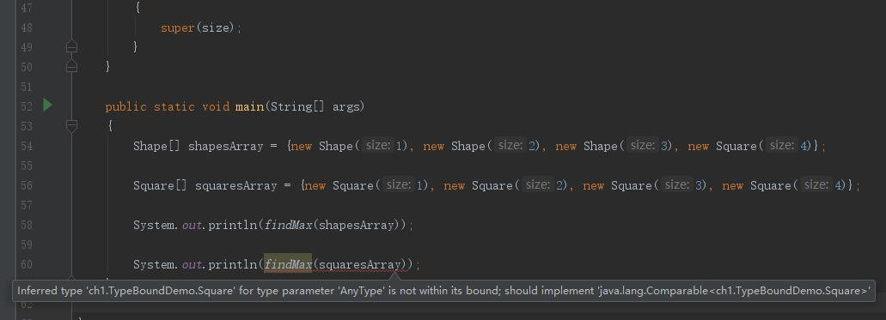

# 阿里之路
> Java学习笔记,欢迎交流

----
## 算法数据结构
> 参考书:《Data Structures And Algorithm analysis in Java 3rd Edition》
### chapter 1: 数据基础
#### 指数 Exponents
#### 对数 Logarithms
#### 级数 Series
#### 取余运算 Modular Arithmetic
#### 证明方法:
* 推导法
* 反证法
#### 递归简介    
#### 泛型简介
##### Pre Java 5

* Java数组为协变数组类型 Covariant array type, 存储不兼容类型会抛ArrayStoreException

##### Java 5 泛型
###### 泛型类和接口
###### 自动装箱
###### <>符
###### 限定范围的通配类型 Wildcards with Bounds
泛型集合类不协变

```
package ch1;

import sun.rmi.server.InactiveGroupException;

public class TypeBoundDemo
{
    public static <AnyType extends Comparable<AnyType>> AnyType findMax(AnyType[] arr)
    {
        int maxIndex = 0;
        for (int i = 0; i < arr.length; i++)
        {
            if (arr[i].compareTo(arr[maxIndex]) > 0)
            {
                maxIndex = i;
            }
        }

        return arr[maxIndex];
    }

    static class Shape implements Comparable<Shape>
    {
        private int size;


        public Shape(int size)
        {
            this.size = size;
        }

        public int compareTo(Shape o)
        {
            return this.size - o.size;
        }

        @Override
        public String toString()
        {
            return size + "";
        }
    }

    static class Square extends Shape
    {
        public Square(int size)
        {
            super(size);
        }
    }

    public static void main(String[] args)
    {
        Shape[] shapesArray = {new Shape(1), new Shape(2), new Shape(3), new Square(4)};

        Square[] squaresArray = {new Square(1), new Square(2), new Square(3), new Square(4)};

        System.out.println(findMax(shapesArray));

        System.out.println(findMax(squaresArray)); //会报错 提示推断的类型不正确, 推断的类型是Square, 但是该类型未实现Compare<Square>
    }

}
```


错误原因是Square 实现了 Compare<Shape>, 未实现Compare<Square>，为了克服泛型不能协变的问题， 需要将findMax做如下修改

```
    public static <AnyType extends Comparable<? super AnyType>> AnyType findMax(AnyType[] arr)
    {
        int maxIndex = 0;
        for (int i = 0; i < arr.length; i++)
        {
            if (arr[i].compareTo(arr[maxIndex]) > 0)
            {
                maxIndex = i;
            }
        }

        return arr[maxIndex];
    }
```
###### 

